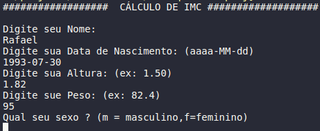
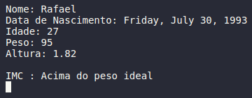

# CalculateBMI
Calulate BMI by a person
This project calculates a person's BMI (brazilian IMC) considering sex difference.

## Interface




## Getting Started

These instructions will get you a copy of the project up and running on your local machine for development and testing purposes.

### Prerequisites

* **.NetCore** 2.1 or higher
```
Tip: Use the command below to check which version is running on your computer.
dotnet --version
```

### Installing

This application do not necessary install because it is a simple code with study purpose.

## Built With

* [Visual Studio Code](https://code.visualstudio.com/docs) - The framework used
* [.NET Core](https://docs.microsoft.com/en-us/dotnet) - Dependency Development

## Author

* **Rafael Silveira** - *One simple thing can change the World* - [GitHub](https://github.com/RafaelLSilveira) - [Linkedin](https://www.linkedin.com/in/rafael-lopes-silveira-aa07209a/) - sepolrafael@gmail.com

## License

This project is licensed under the GNU General Public License - see the [LICENSE.md](LICENSE.md) file for details

## Acknowledgments

* God
